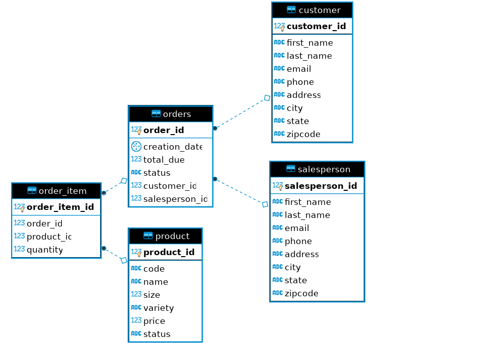

# Introduction
This app will implement the idea of Data Access Object by using Data Transfer Object as an interface, and Database Transaction through the use of JDBC. It can create, update, read, and delete (CRUD) data from a database called "hplussport". In this project, I learned how JDBC works, how to establish a connection between java and database, how to CRUD data in a database, the difference between DAO and Repository pattern, and how to implement database transactions. 

# ER Diagram ER diagram 

# Design Patterns Discuss 
DAO and Repository design patterns Comparison:

