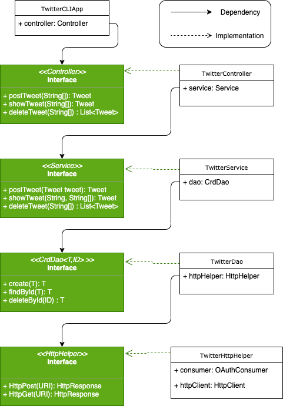

# Introduction 
The function of this app is to post a tweet with coordinates, show a tweet with a certain id, and delete tweets. By implementing this app, I am getting more familiar with the Maven project structure, DTO, and DAO. The concept of OAuth 1.0 protocol and the format of tweet objects are learned. Through the arrangement of the project layers, I have a deep understanding of the MVC design pattern. During the implementation of CLI, I study the basics of the Spring framework and can implement it.

# Design Pattern
## UML Diagram


## Component description
### TwitterHttpHelper
* The function of TwitterHttpHelper is to make a connection between the java application and Twitter server to post, show, or delete a tweet.
### TwitterDao
* The function of TwitterDao is to convert the input from Tweet object to URI format and then invoke post or get method defined in the TwitterHttpHelper.
### TwitterService
* The function of TwitterServer is to validate the input and invoke methods defined in TwitterDao if the input is in the correct format.
### TwitterController
* The function of TwitterController is to validate the input from the command line, convert the input to the correct data type and then invoke the methods defined in the TwitterService.
### TwitterCLIApp
* The function of TwitterCLIApp is to gather inputs from the command line and invoke methods defined in TwitterController if the input is not empty.

# Quick Start
## Maven
* To build the package, proceed to twitter directory and run `mvn package` in the command window.
* To run this app, under twitter directory, run `java -jar target/java_apps-1.0-SNAPSHOT.jar [action] [option(s)]` in the command window. The usage for different actions (post, show, and delete) will be presented in the following sections.

## App Usage
#### Post a Tweet
**Usage**: ` TwitterCLIApp post "Text" "Longitude:Latitude"`
#### Show a Tweet
**Usage**: `TwitterCLIApp show "id" "fields"
-- Fields indicated which part to show in the result (This function is under development).
#### Delete a Tweet
**Usage**: `TwitterCLIApp delete "id_array"
-- The "id_array" is a string that stores a list of id separated by comma.
# Model 
In this app, a Tweet class is set up as a model to store the http response from Twitter server. The response is in Json format and the interested properties are parsed to Tweet object using JsonParser in dao package. An example of  Json with interested properties is shown below.
```Json
//Simplified Tweet Object 
{ "created_at":"Mon Feb 18 21:24:39 +0000 2019", 
"id":1097607853932564480, 
"id_str":"1097607853932564480", 
"text":"test with loc223", 
"entities":{ 
"hashtags":[], 
"user_mentions":[] 
}, 
"coordinates":null, 
"retweet_count":0, 
"favorite_count":0, 
"favorited":false, 
"retweeted":false 
}
```
The nested "coordinates", "entities", "hashtags", and "user_mentions" properties are stored it "Coordinates", "Entities", "Hashtags", and "UserMentions" objects created from their own model class.
# Future Improvements 
1. Add more fields in Tweet DTO so that more features can be shown.
2. Add more options when posting to make tweet more fancy.
3. Add more option to the TwitterCLIApp such as showUser, showTopTrends, etc.
