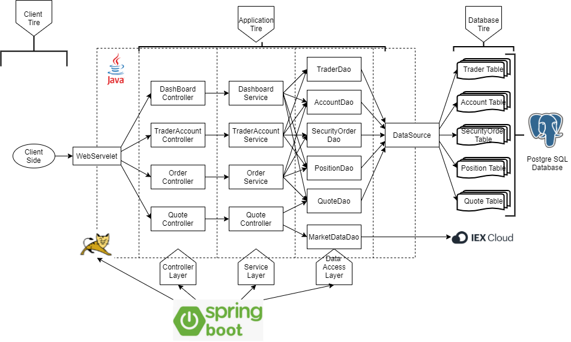
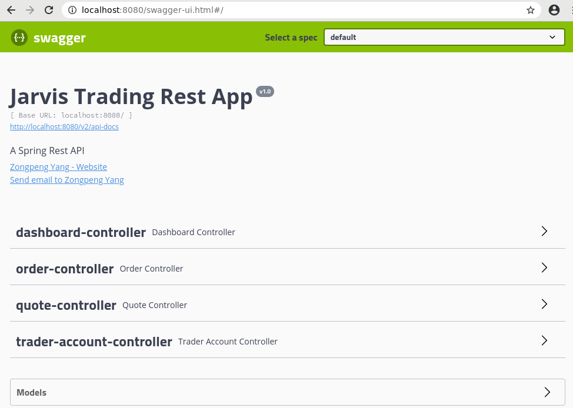
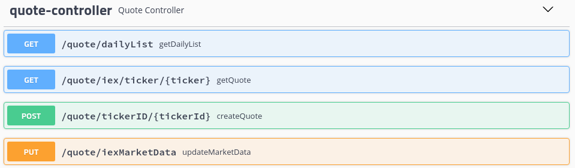
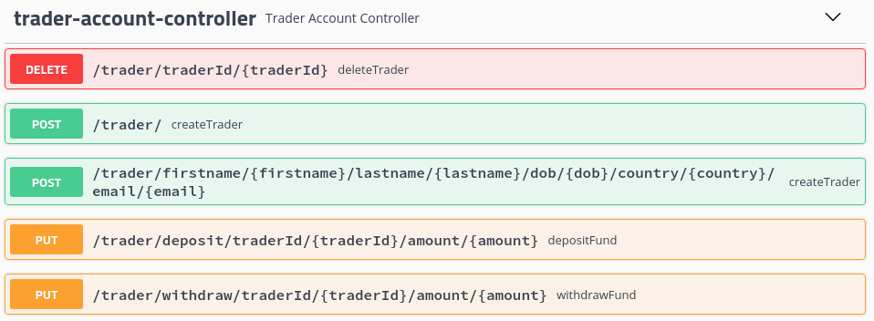
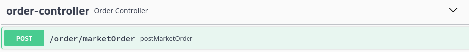
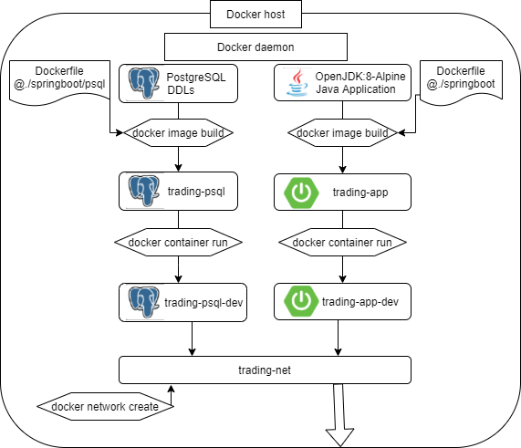

# Trading REST API
* [Introduction](#introduction)
* [Quick Start](#quick-start)
* [Architecture](#architecture)
* [REST API usage](#rest-api-usage)
* [Docker Deployment](#docker-deployment)
* [Improvements](#improvements)

# Introduction
The purpose of this application is to design an online stock trading simulation REST API with microservice and MVC design architecture. This application can fetch market data from external data sources [IEX cloud](https://iexcloud.io/) and store it in the Postgres SQL database along with user(trader) information. The internal dependency management based on Spring Framework is achieved by Spring Boot and external dependency management is done by using Maven. The Docker is able to build an image containing the application using maven and construct container from it. Then it can be tested or examined from a web browser using Swagger or from Postman. This application can be used by either front-end or mobile developer to build a trading app.

# Quick Start
### Prequiresities
Prequiresites to successfully deploy this application:
- CentOS __7__
- Docker (version __17.05__ or higher)
- JDK (version __1.8__)
- Maven
- An account with [IEX cloud](https://iexcloud.io/) to acquire the access token
- If the test of this application is required, it can be done using Swagger on a __Web browser__ or HTTP API client such as __Postman__
### Environmental Variable setup
In this application, there are four environmental variables required. `PSQL_URL` is the datasource URL of the database. In this case, it can be `jdbc:postgresql://localhost:5432/jrvstrading`. `PSQL_USER` and `PSQL_PASSWORD` are the user and password stated when creating the database(as shown in [setup](#docker-setup-before-deployment). In this case, it is `postgres` and `password`. `IEX_PUB_TOKEN` is the access token acquired from [IEX cloud](https://iexcloud.io/).
### Docker setup before deployment
At the very beginning, to ensure the docker is running, use the following command:
```
systemctl status docker || systemctl start docker
```
The **first step** of docker setup is to create a network for the containers with the following command:
```
docker network create --driver bridge trading-net
```
The **second step** of docker setup is to build images. There are two images to build in this application. One is for the database which contains all market data and user information and one is for this application.
At the root directory of this repository, to build an image for Postgres SQL database, enter the following command into the terminal:
```
cd ./springboot/psql 
docker build -t trading-psql .
docker image ls -f reference=trading-psql
```
At the root directory of this repository, to build an image for this application, enter the following command into the terminal:
```
cd ./springboot/
docker build -t trading-app . 
docker image ls -f reference=trading-app
```
The **third** step would be the creation of the Docker containers using the following commands:
```
# container for the Postgres SQL database and attach it to the created network
docker run --name trading-psql-dev \
-e POSTGRES_PASSWORD=password \
-e POSTGRES_DB=jrvstrading \
-e POSTGRES_USER=postgres \
--network trading-net \
-d -p 8080:8080 trading-psql

# container for the application and attach it to the created network
docker run --name trading-app-dev \
-e "PSQL_URL=jdbc:postgresql://trading-psql-dev:5432/jrvstrading" \
-e "PSQL_USER=postgres" \
-e "PSQL_PASSWORD=password" \
-e "IEX_PUB_TOKEN=${IEX_PUB_TOKEN}" \
--network trading-net \
-p 5000:5000 -t trading-app
```
# Architecture

As shown in the above diagram, this application is divided into three tiers: client tier, application tier, and database tier. By doing this, the crush of one tier does not affect another tier. For example, if the application is crushed due to some bugs, the data will still be preserved in the database.
## Project Design Architecture

__Client Tier__
This tier is for the consumer of this application. It could either be a trader who is capable of using the REST API or some endpoints. It can be a Swagger UI, Postman, or even using `curl` command from the Linux system. The HTTP request from this tier will be received and handled by the Tomcat Servlet. After the information is processed, the servelet will send HTTP responses back to the client. And it will be the client's responsibility to format the HTTP responses.
    
__Application Tier__
This tier contains the application developed and it consists of three layers: controller layer, service layer, and data access layer. The purpose of applying three layers here is to make it easier to adapt to changes. For example, if the database is switched from PostgreSQL to another database, only the data access layer will be modified. 

__Database Tier__
This tier is where data is stored, fetched, and manipulated. In this application, a PostgreSQL database is used for storage of the data generated by the application, and the IEX cloud is used as the source of market data. PSQL database is created in a docker container and it can be accessed by java application through the data source. For the IEX cloud, this application will be able to consume the IEX cloud REST API and store the parsed data into the PSQL database.
## Application Design Architecture
In the Application tier, the dependency management is done by Spring Boot. It manages the Tomcat Servlet, maps the HTTP request to the corresponding method in the controller, and generates the HTTP response using the output of the method in the controller tier.

__Controller Layer__
This layer contains a controller for each service. An HTTP request received by the servelet will map the request to the method in the controller, and the controller is responsible for invoking the corresponding method in the service layer. There are four controllers in this application and all endpoints are described in detail under [REST API Usage](#rest-api-usage) section.

__Service Layer__
This layer is the implementation of the business logic provided. Each implemented method will be invoked by its corresponding controller. Moreover, all methods in this layer are transactional which means it will only invoke the DAO layer only if there is no error.
        
__Data Access Layer__
This layer will interact with the database tier and its responsibility is to insert, find, update or delete a row in the database. Moreover, it will also be able to pull market data from the IEX cloud. The DAO (data access object) is designed based on a repository pattern. Each DAO is responsible for one table in the database and uses the model created for its corresponding table.

# REST API Usage

### Test with Swagger UI or Postman
1. Swagger UI
Swagger is a set of open-source tools based on the OpenAPI Specification. It will help developers design, build, document and consume REST APIs. Swagger UI is the user interface generated by Swagger when trying to consume the REST API. To use Swagger UI, go to `http://localhost:8080/swagger-ui.html#/` on the host machine's internet browser. Below is a screenshot of what it should look like if everything is done correctly.

2. Postman
Postman can also be used to interact with this application through HTTP requests. To do that, simply go to the link in the Swagger UI called `http://localhost:8080/v2/api-docs`, save the page to local machine and import this file using Postman. Or it can also be done by typing the URL manually. 

## Swagger
In the following description of the endpoints, the screenshot of Swagger UI is used. The same result can also be achieved using Postman or `curl` command in Linux. However, Swagger UI is used as an example in this case because it looks good. Each endpoint will be described in detail in the following sections with the order presented in screentshot of each controller.

### Quote Controller

__GET__ `/quote/dialyList`
- This endpoint will return all the quotes currently stored in the database.

__GET__ `/quote/iex/ticker/{ticker}`
- This endpoint will get the most recent market data from the IEX cloud with the specified ticker. It will return the market data directly.

__POST__ `/quote/tickerID/{tickerId}`
- This endpoint will pull the most recent market data from the IEX cloud with the given ticker and save it to the database. It will return the saved quote.

__PUT__ `/quote/iexMarketData`
- This endpoint will pull the most recent market data from the IEX cloud for every quote that exists in the database. It will only update the quotes that are currently in the database instead of creating new ones.
### Trader Account Controller

__DELETE__ `/trader/traderId/{traderId}`
- This endpoint will delete a trader and the account associated with that trader. If the fund balance is not 0 or this trader is still holding securities, it will return bad HTTP status code. If the deletion succeeds, it will return good HTTP status code.

__POST__ `/trader`
- This endpoint will use the trader information in the HTTP request and create a trader and an associated account. All fields except the ID field should not be null. It will return the trader's profile and account.

__POST__`/trader/firstname/{firstname}/lastname/{lastname}/dob/{dob}/country/{country}/email/{email}`
- This endpoint will do the same thing as the above endpoint. However, the information of the trader is included in the endpoint URL instead of the HTTP request header.

__PUT__`/trader/deposit/traderId/{traderId}/amount/{amount}`
- This endpoint will deposit the specified amount of funds into a given trader's account and it will return the new account information.

__PUT__`/trader/withdraw/traderId/{traderId}/amount/{amount}`
- This endpoint will withdraw the specified amount of fun from the given trader's account. It will return bad HTTP status code if there is an insufficient fund available. If it succeeds, it will return the new account information.
### Order controller

__POST__ `/order/marketOrder`
- This endpoint will submit a market order. Based on the value given for the position of security, it will determine whether to buy or sell the security. In case of buying the security, a bad HTTP status code will be return if the ask size of this security is smaller than the position required or there is an insufficient fund to buy the security. In case of selling the security, a bad HTTP status code will be return if the owned position of this security is smaller than the given position. Otherwise, if the execution of the market order succeeds, it will return the executed security order.

### Dashboard controller

__GET__ `/dashboard/portfolio/traderId/{traderId}`
- This endpoint will return all the securities owned by the given trader. For each security owned, it will show its ticker, position, and current quote. It will return bad HTTP status code if the given trader ID cannot be found.

__GET__ `/dashboard/profile/traderId/{traderId}`
-  This endpoint will return the trader information along with the associated account information for the given trader ID. It will return bad HTTP status code if the given trader ID cannot be found.


# Docker Deployment


As mentioned before, the database needs to be launched in a docker container to use this application. The above diagram illustrates what is going on by doing that. Initially, it will create a docker network for future use(it is shown at the bottom of the diagram). For the second step, it will build a PostgreSQL using the Dockerfile under `./springboot/psql/` directory. It will execute the `schema.ddl` to set up the database. It will also build an image using Dockerfile under `./springboot/` directory. It will package the java application using maven and build an image from it. The last step would be the creation of the container from the images and attached them to the `trading-net` created before.

# Modification by another project
In this project, the files under the script folder, the JenkinsFile, and the health endpoint is not part of this project. For more information, please see [Cloud & DevOps](../cloud_devops) project.

# Improvements
1. Enrich the content of the quote to contain more information.
2. Add a new function to delete a trader and return the balance. If this trader own securities, it will sell all of them, add fund to the balance, and return the new balance.
3. Separate the function of the order controller into two smaller functions to avoid confusion.
4. Add a function to let one trader buy security from another trader and make this service transactional to prevent error.
5. Allow one trader to have multiple accounts so that the trader could open up multiple accounts for different reasons.
